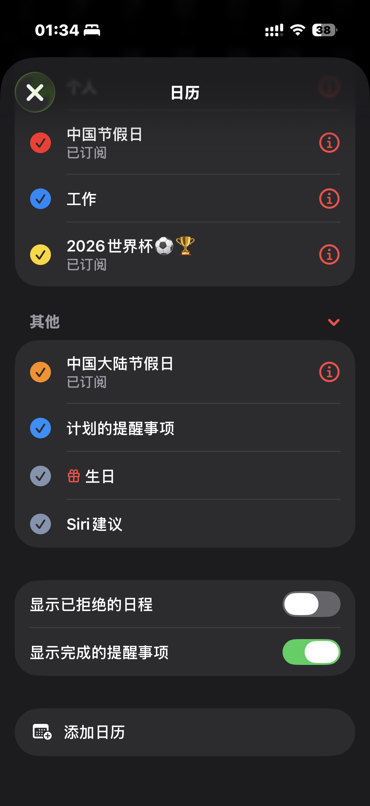
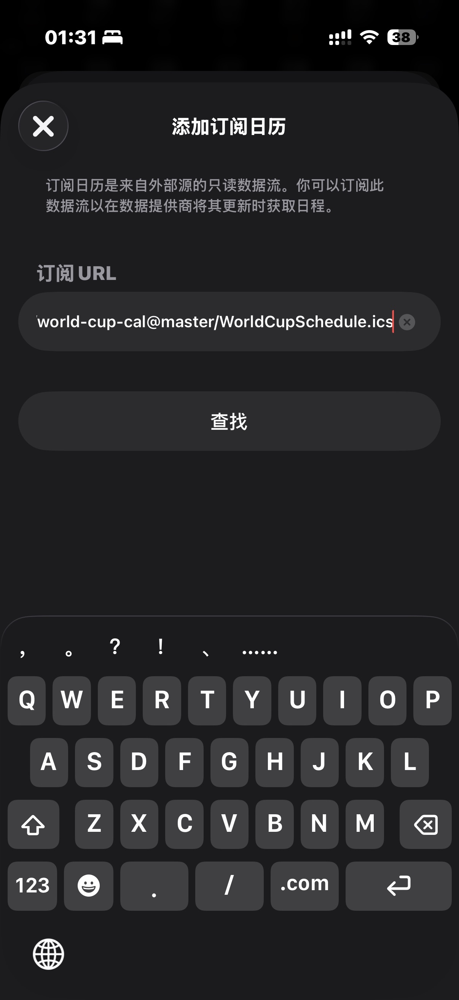
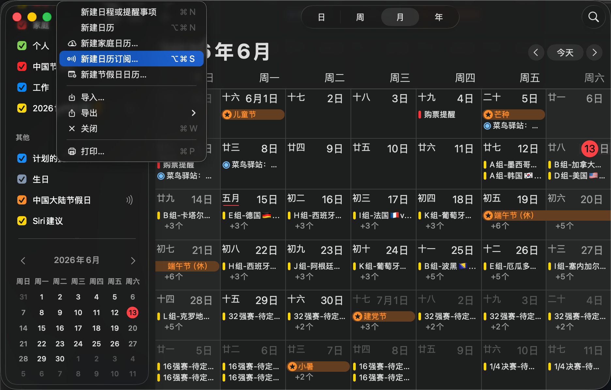
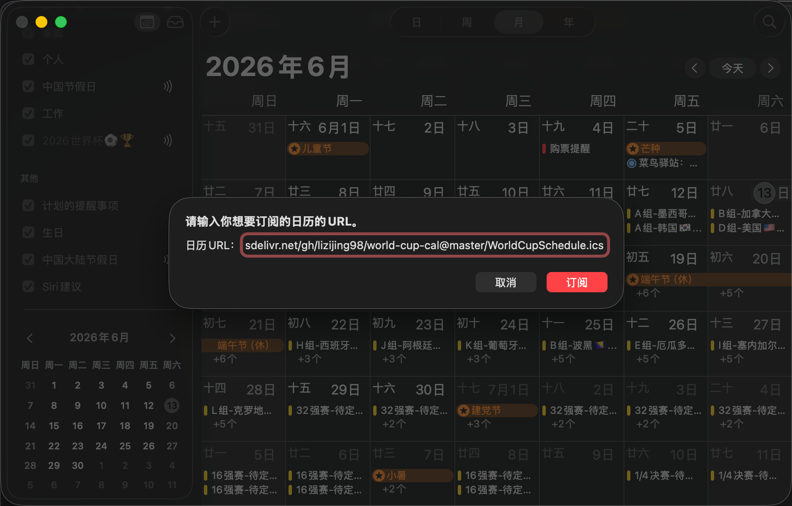
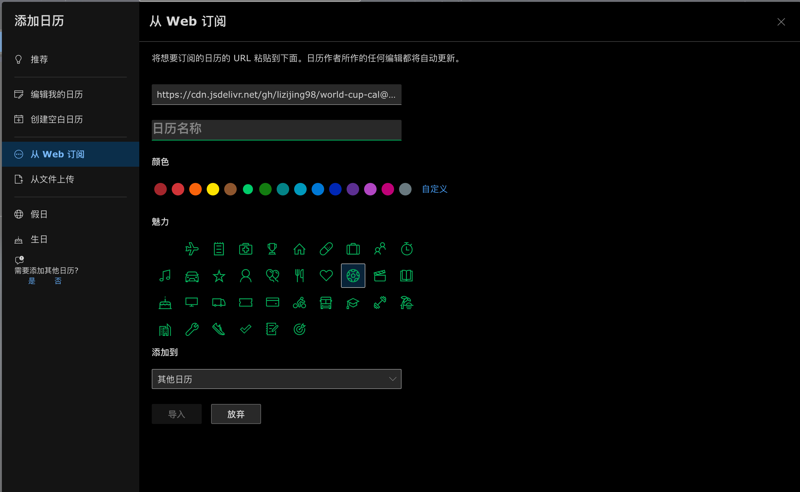
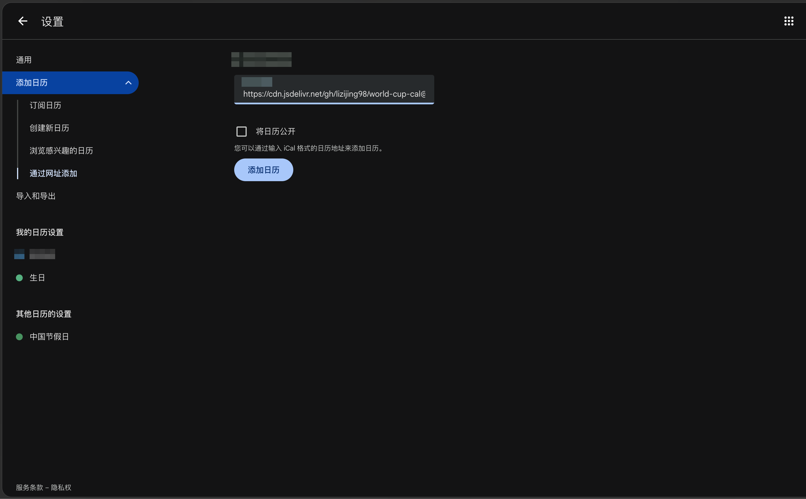

# 世界杯比赛日历iCal订阅

## 使用方式

在支持ics订阅的软件中订阅下方提供的订阅地址, 如 iPhone/Mac/Android中的日历App、Outlook、Google 日历. 如果软件有自动更新订阅的设置, 推荐改为每日更新.

  
  

  
  
  
  

## 服务订阅

订阅ics文件可主动更新，推荐使用此方法订阅

* ics文件订阅地址: 

> https://cdn.jsdelivr.net/gh/lizijing98/world-cup-cal@master/WorldCupSchedule.ics

* github订阅地址(GFW内不稳定需代理): 

> https://raw.githubusercontent.com/lizijing98/world-cup-cal/master/WorldCupSchedule.ics

## 更新

- 2026-01-23
  * 更新了2026美加墨世界杯的ics文件

- 2026-03-01
  * 重构项目, 通过接口获取数据
  * 新增Github Actions, 自动更新ics文件

- 2026-04-02
  * 更新2026年美加墨的全部参赛队伍
  * 新增自动发布Release的Github Actions

- 2026-06-13
  * 修改GitHub Actions的触发时间为北京时间12:10
  * 修改README, jsdelivr链接增加master分支标识